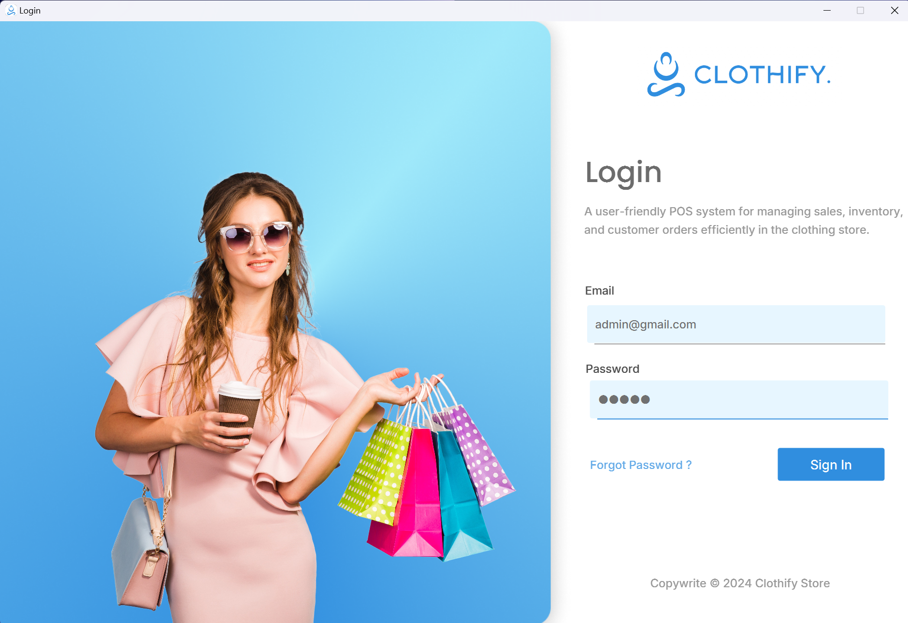

# Clothify Store System

**Version:** 1.0.1

Welcome to the Clothify Store System repository! This project is a comprehensive Point of Sale (POS) and Management system tailored for a clothing store. The application is designed to simplify order processing, customer and employee management, and includes a secure login configuration.

### Login Interface


## Features

### 1. **Order Management**
- Allows seamless order placement and tracking.
- View, update, and manage all orders efficiently.

### 2. **Employee Management**
- Manage employee details, roles, and permissions.
- Track employee performance and view sales reports.

### 3. **Customer Management**
- Maintain customer information and order history.
- Provide personalized services based on customer preferences and history.

### 4. **Order Placement and Tracking**
- Easy-to-use interface for placing and tracking orders.
- Option to apply discounts and promotions to orders.

### 5. **Email Notification Service**
- Send order confirmations and updates directly to customers’ emails.
- Supports automated notifications for order status changes.

### 6. **Secure Login System**
- Role-based access control with secure login.
- Only authorized users can access certain functionalities based on roles (e.g., Admin, Sales Staff).

### 7. **Product Management** 
- Manage and categorize store inventory.
- Add new products, update prices, and monitor stock levels.

### 8. **Monthly Sales Report and Analytics** 
- Generate monthly sales reports to view performance.
- Visual graphs and data analytics for better decision-making.

## Screenshots

### Dashboard Interface


### Employee Management Interface


### Order Management Interface


### Place Order Interface


## Installation

1. Clone the repository:
   ```sh
   git clone https://github.com/IroshanRathnayake/clothify-store-JavaFx.git
